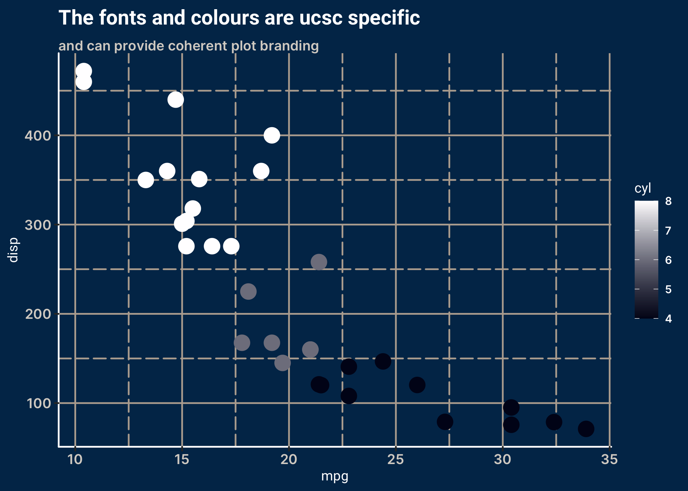

<!-- README.md is generated from README.Rmd. Please edit that file -->

# ucscthemes

<!-- badges: start -->

[](https://CRAN.R-project.org/package=ucscthemes)
[](https://lifecycle.r-lib.org/articles/stages.html#experimental)
<!-- badges: end -->

The goal of ucscthemes is to provide branded templates for the
University of Oslo for commonly used R markdown packages. Currently the
package contains:

-   Presentation template for the
    [xaringan](https://slides.yihui.org/xaringan/#1)-package  
-   Tutorial template for the
    [learnr](https://rstudio.github.io/learnr/)-package  
-   Website template for the
    [distill](https://rstudio.github.io/distill/website.html)-package  
-   Article template for the
    [distill](https://rstudio.github.io/distill/basics.html)-package  
-   Themes for the [ggplot2](https://ggplot2.tidyverse.org/)-package  
-   Colour and fill scales for the
    [ggplot2](https://ggplot2.tidyverse.org/)-package
-   Course skeleton creation based on
    [bs4](https://pkgs.rstudio.com/bookdown/reference/bs4_book.html)

## Installation

You can install ucscthemes from github

``` r
# install.packages("remotes")
remotes::install_github("NiccoloSalvini/ucscthemes")
```

<!-- You can install the released version of ucscthemes from [CRAN](https://CRAN.R-project.org) with: -->
<!-- ``` r -->
<!-- install.packages("ucscthemes") -->
<!-- ``` -->

## Basic use

xaringan presentation, learnr tutorial and distill article templates
with ucsc branding can be access easily using the RStudio IDE, by
selecting `File` -\> `R markdown ...` -\> `From Template`.

Distill website template can be access most easily through the RStudio
IDE to create a new project. `File` -\> `New project...` -\>
`New Directory` -\> `ucsc Distill Website`

**Previews**

<div style="text-align: center;">

</div>

### ggplot2 branding

The ggplot branding is applied through themes and scales.

``` r
library(ucscthemes)
library(ggplot2)

## issue with font theme

ggplot(mtcars, aes(mpg, disp, colour = cyl)) +
  geom_point(size = 5) +
  scale_colour_ucsc(discrete = FALSE) +
  labs(title = "The fonts and colours are ucsc specific",
       subtitle = "and can provide coherent plot branding")+
  theme_ucsc()
```


``` r
  

ggplot(mtcars, aes(mpg, disp, colour = cyl)) +
  geom_point(size = 5) +
  scale_colour_ucsc(palette = "bw", discrete = FALSE) +
  theme_ucsc_dark() +
  labs(title = "The fonts and colours are ucsc specific",
       subtitle = "and can provide coherent plot branding")
```


