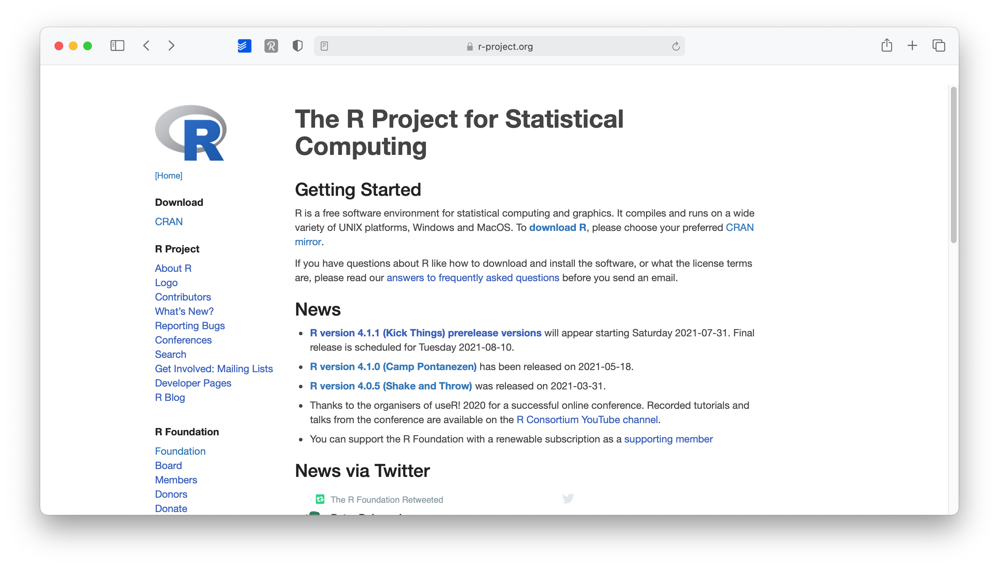
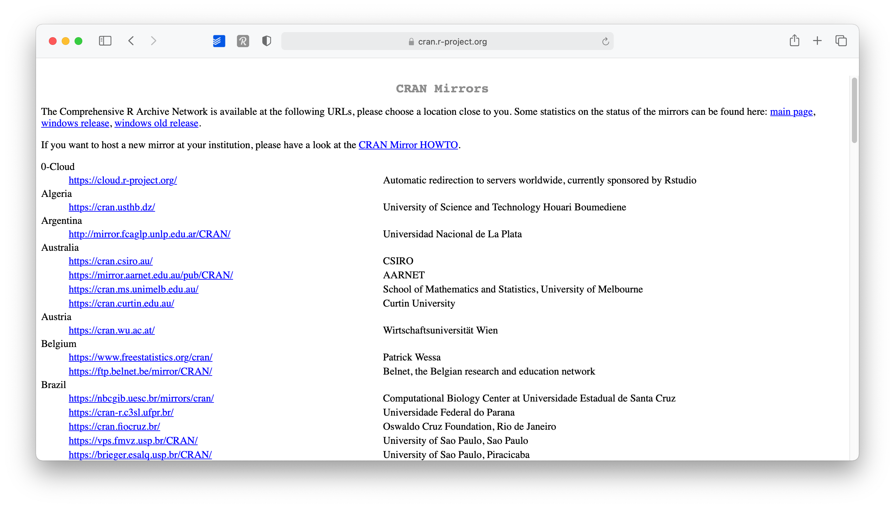
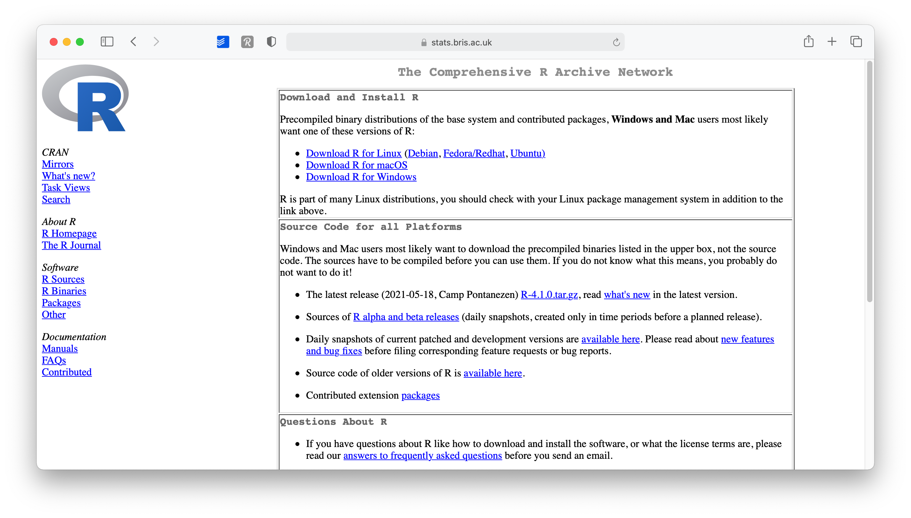
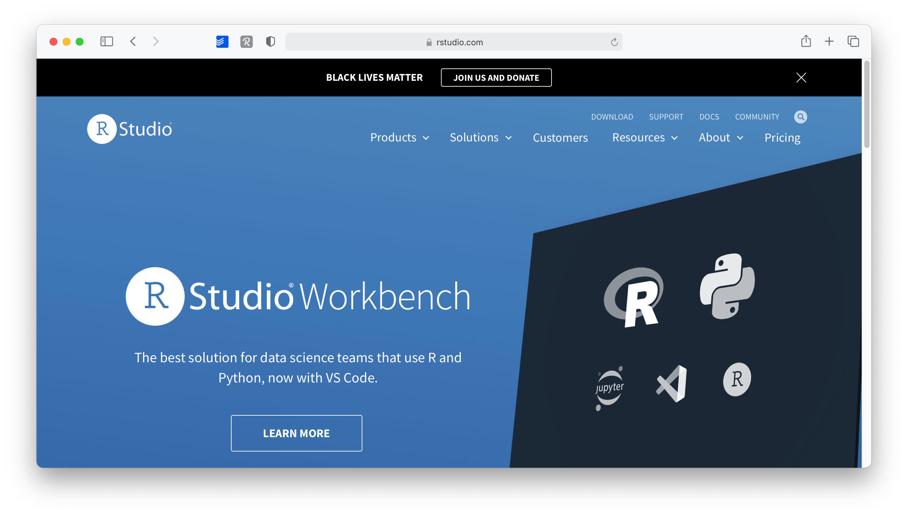
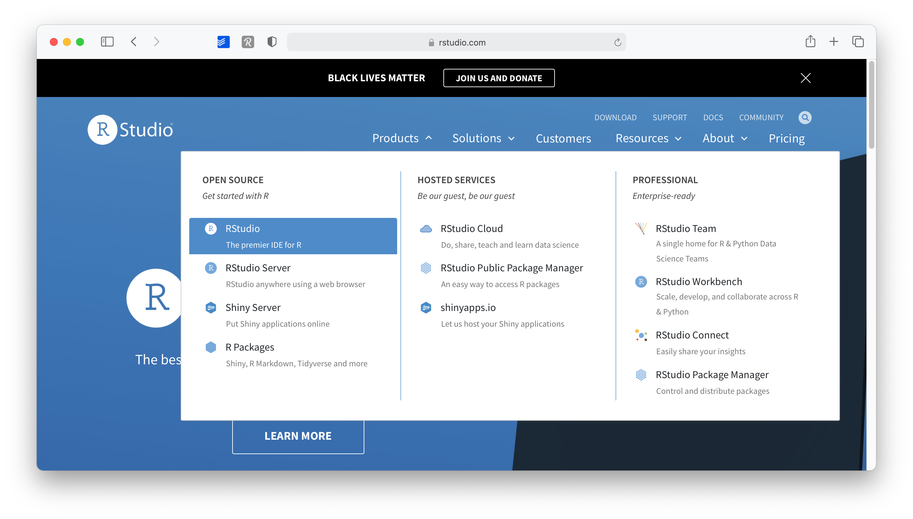
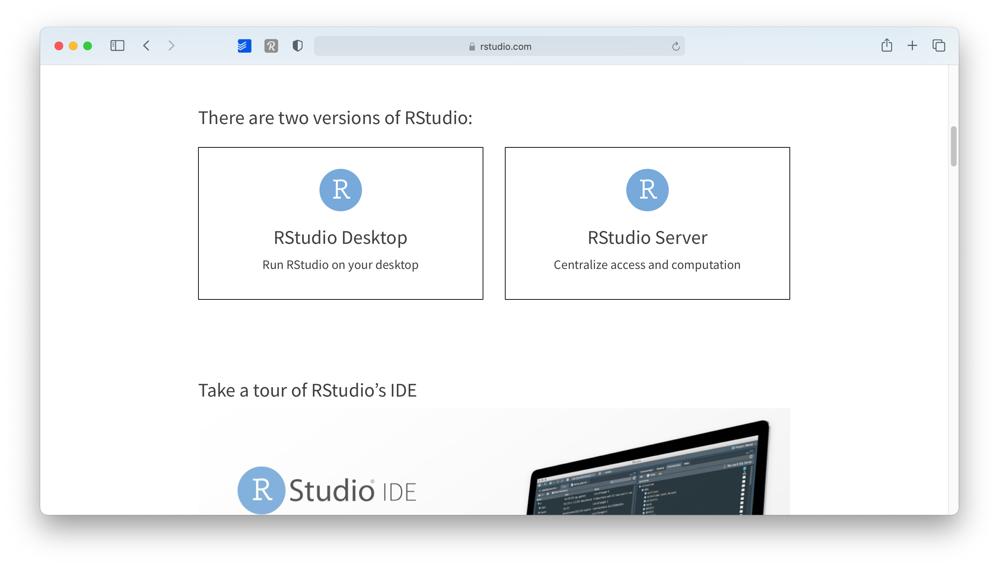
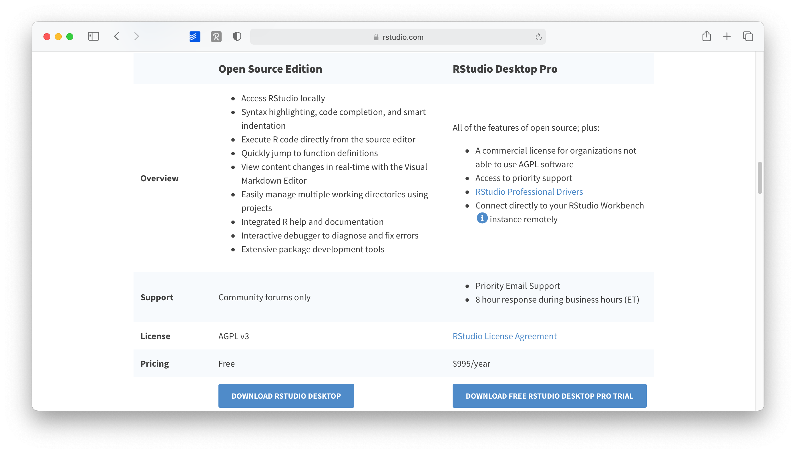
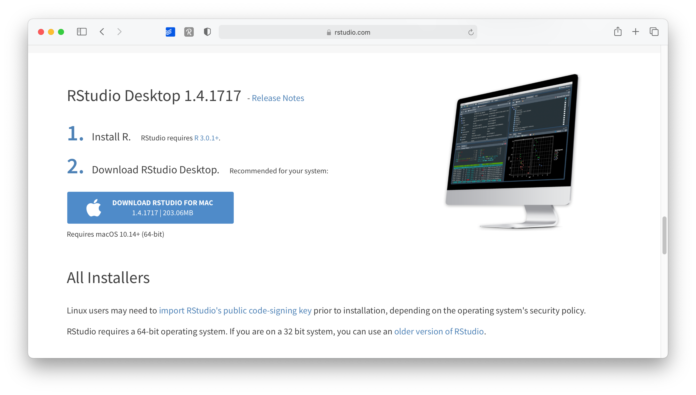
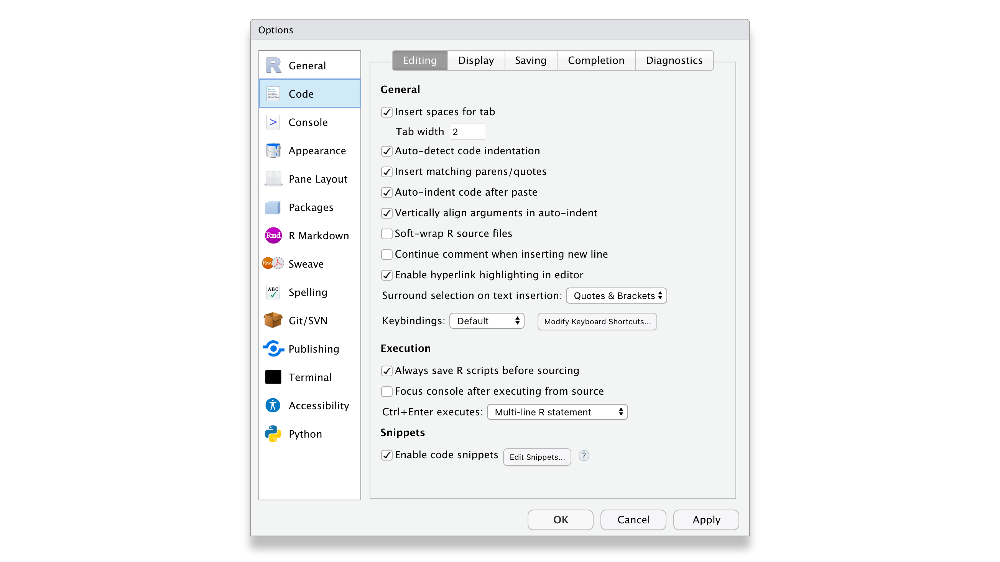

# ✨Prerequisites

## Setting up R and RStudio

To get started with R, you need to acquire your own copy. This appendix will show you how to download R as well as RStudio, a software application that makes R easier to use. You’ll go from downloading R to opening your first R session.

Both R and RStudio are free and easy to download.

## How to Download and Install R

R is maintained by an international team of developers who make the language available through the web page of The Comprehensive R Archive Network i.e. CRAN. The top of the web page provides three links for downloading R. Follow the link that describes your operating system: Windows, Mac, or Linux.

### **R in Windows**

To install R on Windows, click the “Download R for Windows” link. Then click the “base” link. Next, click the first link at the top of the new page. This link should say something like “Download R 3.0.3 for Windows,” except the 3.0.3 will be replaced by the most current version of R. The link downloads an installer program, which installs the most up-to-date version of R for Windows. Run this program and step through the installation wizard that appears. The wizard will install R into your program files folders and place a shortcut in your Start menu. Note that you’ll need to have all of the appropriate administration privileges to install new software on your machine. (more detailed steps)

### **R in Mac**

This is also my setup, feel free to reach me at  [my mail address](mailto:niccolo.salvini27@gmail.com) if something is messed up.

1. Go to [www.r-project.org](www.r-project.org)

```{r rproj-page, echo = FALSE, fig.cap = "The R mirrors website"}

```

  
2.  Click on `CRAN` where it says `Download`.

3.  Choose a server in your country (all of them work, but downloads will perform quicker if you choose your country or one that is close to where you are).

```{r cran-mirrors, echo = FALSE, fig.cap = "CRAN mirrors"}

```

4.  Select the operating system for your computer, for example `Download R for macOS`.

```{r os-choice, echo = FALSE, fig.cap = "OS choices available"}

```


5.  Select the version you want to install (I recommend the latest version)

```{r r-versions, echo = FALSE, fig.cap = "R versions available"}
knitr::include_graphics("images/cpt_1/03_r_project_version_choice.png")
```

6.  Open the downloaded file and follow the installation instructions. I recommend leaving the suggested settings as they are.

:::note
**Binaries Versus Source**

R can be installed from precompiled binaries or built from source on any operating system. For Windows and Mac machines, installing R from binaries is extremely easy. The binary comes preloaded in its own installer. Although you can build R from source on these platforms, the process is much more complicated and won’t provide much benefit for most users. For Linux systems, the opposite is true. Precompiled binaries can be found for some systems, but it is much more common to build R from source files when installing on Linux. The download pages on CRAN’s website provide information about building R from source for the Windows, Mac, and Linux platforms.
:::

### **R in Linux**

R comes preinstalled on many Linux systems, but you’ll want the newest version of R if yours is out of date. The CRAN website provides files to build R from source on Debian, Redhat, SUSE, and Ubuntu systems under the link “Download R for Linux.” Click the link and then follow the directory trail to the version of Linux you wish to install on. The exact installation procedure will vary depending on the Linux system you use. CRAN guides the process by grouping each set of source files with documentation or README files that explain how to install on your system.

:::note
**32-bit Versus 64-bit**

R comes in both 32-bit and 64-bit versions. Which should you use? In most cases, it won’t matter. Both versions use 32-bit integers, which means they compute numbers to the same numerical precision. The difference occurs in the way each version manages memory. 64-bit R uses 64-bit memory pointers, and 32-bit R uses 32-bit memory pointers. This means 64-bit R has a larger memory space to use (and search through).
As a rule of thumb, 32-bit builds of R are faster than 64-bit builds, though not always. On the other hand, 64-bit builds can handle larger files and data sets with fewer memory management problems. In either version, the maximum allowable vector size tops out at around 2 billion elements. If your operating system doesn’t support 64-bit programs, or your RAM is less than 4 GB, 32-bit R is for you. The Windows and Mac installers will automatically install both versions if your system supports 64-bit R.
:::

## Using R

R isn’t a program that you can open and start using, like Microsoft Word or Internet Explorer. Instead, R is a computer language, like C, C++, or UNIX. You use R by writing commands in the R language and asking your computer to interpret them. In the old days, people ran R code in a UNIX terminal window—as if they were hackers in a movie from the 1980s. Now almost everyone uses R with an application called RStudio, and I recommend that you do, too.

:::fyi

**R and UNIX**

You can still run R in a UNIX or BASH window (prompt or Powershell) by typing the command:
R
which opens an R interpreter. You can then do your work and close the interpreter by running `q()` when you are finished.
:::

## Using RStudio

*R* by itself is just the '*beating heart*' of *R* programming, but it has no particular user interface. If you want buttons to click and actually '*see*' what you are doing, there is no better way than RStudio. RStudio is an *integrated development environment* (IDE) and will be our primary tool to interact with *R*. It is the only software you need to do all the fun parts and, of course, to follow along with the examples of this book. To install RStudio perform the following steps:

:::puzzle
**Same DNA, New Name.**
RStudio is rebranding itself changing name as **Posit**, PBC in October! That means that they are changing their website appeareance too, so screenshots in there might not be accurate.
They chose Posit as the new name of the company because it is a real word describing what in their opinion customers do - "They put forward ideas and critically analyze them". Iy you are curiosu check [this blog](https://www.rstudio.com/blog/rstudio-is-becoming-posit/) post from Posit ex RStudio CEO
:::


1.  Go to [www.rstudio.com](https://www.rstudio.com "www.rstudio.com")

```{r rstudio-main, echo = FALSE, fig.cap = "The RStudio main page"}

```

2.  Go to `Products > RStudio`.

```{r rstudio-products, echo = FALSE, fig.cap = "RStudio products"}

```

3.  On this page, scroll down and select `RStudio Desktop`.

```{r rstudio-select-version, echo = FALSE, fig.cap = "Choose RStudio version"}

```
  
4.  Select the `Open Source Edition` option by clicking on `Download RStudio Desktop`.

```{r rstudio-select-edition, echo = FALSE, fig.cap = "Choose RStudio edition"}

```

  
5.  As a last step, scroll down where it shows you a download button for your operating system. The website will automatically detect this. You also get a nice reminder to install *R* first, in case you have not done so yet.

```{r rstudio-download, echo = FALSE, fig.cap = "Download RStudio"}

```

6.  Open the downloaded file and follow the installation instructions. Again, keep it to the default settings as much as possible.

Congratulations, you are all set up to learn *R*. From now on you only need to start RStudio and not *R*. Of course, if you are the curious type, nothing shall stop you to try *R* without RStudio.


## When you first start RStudio {#when-you-first-start-rstudio}

Before you start programming away, you might want to make some tweaks to your settings right away to have a better experience (in my humble opinion). To open the Rstudio settings you have to click on

-   `RStudio > Preferences` or press `⌘ + ,` if you are on a Mac.

-   `RStudio > Tools > Global Options` or press `Ctrl + ,` if you work on a Windows computer.

I recommend to at least make the following changes to set yourself up for success right from the beginning:

1.  Already on the first tab, i.e. `General > Basic`, we should make one of the most significant changes. Deactivate every option that starts with `Restore`. This will ensure that every time you start RStudio, you begin with a clean slate. At first sight, it might sound counter-intuitive not to restart everything where you left off, but it is essential to make all your projects easily reproducible. Furthermore, if you work together with others, not restoring your personal settings also ensures that your programming works across different computers. Therefore, I recommend having the following unticked:

    -   `Restore most recently opened project at startup`,

    -   `Restore previsouly open source documents at startup`,

    -   `Restore .Rdata into workspace at startup`


```{r rstudio-preferences, echo = FALSE, fig.cap = "get your RStudio preferences"}
knitr::include_graphics("images/cpt_1/00_rstudio_preferences_basic.png")
```


2.  In the same tab under `Workspace`, select `Never` for the setting `Save workspace to .RData on exit`. One might think it is wise to keep intermediary results stored from one R session to another. However, I often found myself fixing issues due to this lazy method, and my code became less reliable and, therefore, reproducible. With experience, you will find that this avoids many headaches.

3.  In the `Code > Editing` tab, make sure to have at least the first five options ticked, especially the `Auto-indent code after paste`. This setting will save time when trying to format your coding appropriately, making it easier to read. Indentation is the primary way of making your code look more readable and less like a series of characters that appear almost random.

```{r rstudio-prefediting, echo = FALSE, fig.cap = "Pimp your RStudio IDE"}

```

4.  In the `Display` tab, you might want to have the first three options selected. In particular, `Highlight selected line` is helpful because, in more complicated code, it is helpful to see where your cursor is.

```{r rstudio-prefdisp, echo = FALSE, fig.cap = "Edit your RStudio display preferences"}
knitr::include_graphics("images/cpt_1/02_rstudio_preferences_display.png")
```


Of course, if you wish to customise your workspace further, you can do so. The visually most impactful way to alter the default appearance of RStudio is to select `Appearance` and pick a completely different colour theme. Feel free to browse through various options and see what you prefer. There is no right or wrong here. Just make it your own.

```{r rstudio-prefappear, echo = FALSE, fig.cap = "This will get you instantly nerd"}
knitr::include_graphics("images/cpt_1/03_rstudio_preferences_appearance.png")
```


## Updating R and RStudio: Living at the pulse of innovation {#updating-r-and-rstudio}

While not strictly something that helps you become a better programmer, this advice might come in handy to avoid turning into a frustrated programmer. When you update your software, you need to update *R* and RStudio separately from each other. While both *R* and RStudio work closely with each other, they still constitute separate pieces of software. Thus, it is essential to keep in mind that updating RStudio will not automatically update R. This can become problematic if specific tools you installed via RStudio (like a fancy learning algorithm) might not be compatible with earlier versions of *R*. Also, additional *R* packages (see Chapter \@ref(r-packages)) developed by other developers are separate pieces which require updating too, independently from *R* and RStudio.

I know what you are thinking: This already sounds complicated and cumbersome. However, rest assured, we take a look at how you can easily update all your packages with RStudio. Thus, all you need to remember is: *R* needs to be updated separately from everything else.
